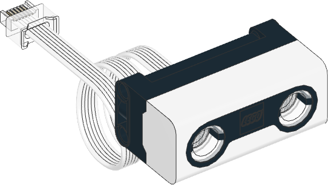

# Pybricks Switch Controller
Automate your LEGO train tracks by randomly change the direction of switches by detecting incoming trains. An example usage is presented here: https://youtu.be/EsnzuTQ5WIw?t=199

In principle, all the programs work in the same way: Trains are detected by an distance sensor which causes the switch to change direction (at least with some probability). The reason for the different program files consists in
- the different hardware components (powered up City Hub/ Technic Hub, MINDSTORMS Robot Inventor 51515, MINDSTORMS EV3 31313, Spike Prime)
- the different possible switch layouts (1 sensor + 1 switch, 1 sensor + 2 switches in a row, 2 sensors with 1 switch each, ...)

Most of the provided programs are running [PyBricks](https://pybricks.com/) code. However, for LEGO MINDSTORMs EV3 (31313) [EV3 MicroPython](https://pybricks.com/ev3-micropython/) is used. The LEGO MINDSTORMS Robot Inventor (51515) can be used either with PyBricks or with the official [LEGO MINDSTORMS Software with Python Programming](https://lego.github.io/MINDSTORMS-Robot-Inventor-hub-API/).

To get the motor rotation change the direction of the switch, a design of [SteinaufStein](https://www.youtube.com/channel/UCJ-c1vQHVZZ6S6xhjjNo7Gg) is used ([video tutorial](https://youtu.be/Jwv6kI0IBoQ?t=63)). Note that for some motors (like most of the powered up motors) an additional gear ration is needed since the motors are too weak to move. 


## Powered Up Hubs
All the programs for powered up hubs are running [PyBricks](https://pybricks.com/) code. The following description uses some PyBricks specific terms, so read their [documentation](https://docs.pybricks.com/en/stable/) to understand details. Also refer to [here](https://code.pybricks.com/) in order to actually run the provided python code on your powered up hubs.

For controlling the switches, you can use any type of motor with rotation sensor being compatible with the powered up system. The following picture from the (PyBricks Documentation](https://docs.pybricks.com/en/latest/pupdevices/index.html) shows the compatible motors.

These motors occur in motorized LEGO Technic Sets (like Liebherr R 9800 Excavator (42100), App-Controlled Cat® D11 Bulldozer (42131)) and in LEGO MINDSTORMS/ SPIKE sets (like Robot Inventor (51515), SPIKE Prime Set (45678)). 

As sensor any sensor which can determine a distance is possible. The pictures are again taken from the (PyBricks Documentation](https://docs.pybricks.com/en/latest/pupdevices/index.html).

| **Sensor** | **Color & Distance Sensor** | **Infrared/ Motion Sensor** | **Ultrasonic Sensor** | **Color Sensor** |
|-|-|-|-|-|
| LEGO item/ part number | item 88007 | item 20844 | part 37316c01 | part 37308c01 |
| LEGO sets with this sensor | BOOST Creative Toolbox (17101), Droid Commander (75253), [sold as single item at LEGO store](https://www.lego.com/en-us/product/color-distance-sensor-88007) |  Grand Piano (21323), WeDo 2.0 Core Set (45300) | Robot Inventor (51515), SPIKE Prime Set (45678) | Robot Inventor (51515), SPIKE Essential Set (45345), SPIKE Prime Expansion Set (45681), SPIKE Prime Set (45678) |
| Picture |  |  |  |  |

Since all sensors except the Color & Distance Sensor is used only in MINDSTORMS/ SPIKE sets (which are EOL 2022), this sensor seems to be the most suitable - also because it is sold individually by LEGO and is relatively cheap.

Once you have organized the hub, motor(s) and sensor(s), you are ready to run the program. Therefore you need a hub dependant *code basis* and a switch layout dependant *configuration part*

### Code Basis
| City Hub | [CityHub.py](CityHub.py) |
|-|-|
| Technic Hub | [TechnicHub.py](TechnicHub.py) |

### Configuration Part
Depending on your actual switch layout, you need to add a few lines to the program right below the line `# configure your switch layout here`.

The following examples should cover the most important switch-sensor-motor-combinations. You might need to make little changes (like changing the used sensor type, port or parameter values).

<table>
<tr>
  <td>Description </td> <td>Picture </td> <td>Easy Code </td> <td>Advanced Code</td>
</tr>
<tr>
  <td>1 Sensor + 1 Switch </td> <td>TODO</td>
<td>

```python
sensor = SwitchDistanceSensor(Port.A)
motor = SwitchMotor(Port.B)
controller.registerSensor(sensor, motor)
```

  </td><td>

```python
# create a SwitchDistanceSensor with higher critical distance (60) instead of the default value 40 -> sensor can be placed further away from the tracks
sensor = SwitchDistanceSensor(Port.A, criticalDistance=60)
# probability_straigth_to_curved > probability_curved_to_straigth means that the switch will be more often in the curved state than in the straight one
motor = SwitchMotor(Port.B, probability_curved_to_straigth=0.5, probability_straigth_to_curved=0.8)
controller.registerSensor(sensor, motor)
```

  </td>
</tr>
<tr>
<td> 400 </td>
  <td>TODO</td>
<td>

**Markdown** _here_. (Blank lines needed before and after!)

</td>
</tr>
</table>


### City Hub
Since the [City Hub](https://www.lego.com/en-us/product/hub-88009) (the hub used for the City trains) has only two ports, the only possible configuraiton consists of  


In order to use a different sensor instead, you would need to change a few lines of the program: 
- For 1 sensor + 1 switch: replace any occurence in the program of *ColorDistanceSensor* by the name of your device (like *InfraredSensor*, *ColorSensor* or *UltrasonicSensor*)
- For all other programs: Use the corresponding SwitchSensor implementation, i.e. *SwitchDistanceSensor* (used in the program), *SwitchIRSensor*, *SwitchUltrasonicSensor* or *SwitchColorSensor* 

|Description | Image | Programs |
|-|-|-|-|
|1 Sensor + 1 Switch | TODO with Ports | [CityHub](powered_up_switch_1_City_Hub.py), [TechnicHub](powered_up_switch_1_Technic_Hub.py) |
|1 Sensor + 2 Switchs | | |
|1 Sensor + 3 Switches | | |
|2 Sensors + 2 Switches | | | 

Note that the structure of the 1 sensor + 1 switch program differs completely compared to the other programs which are using a common code basis with object oriented programming. Actually the 1 sensor + 1 switch functionality can be easily achieved using the object oriented approach as well (the object oriented code basis is much more powerful, flexible and complicated). But the provided programs for 1 sensor + 1 switch are much easier to understand than the object oriented ones, so use whatever fits your needs best.

Personally, I recommend to first running the program without including the current program to the firmware. So you can easily experiment different settings and see what fits your purposes best (errors can be seen in the terminal). Once the program is ready flash the hub with including the current program to the firmware (Currently this option is available under "Settings" -> "Firmware" -> "Include current program"). This causes that flashed program is executed whenever the hub is started in the future - unless you reflash it again. You can easily reflash the original LEGO firmware by connecting the hub to the powered up app. The disadvantage of the flashing the program to the firmware is that you can no longer see the terminal output, so make sure that the program runs without errors before doing this.

### Special Features
- **Colors**
  - RED: Switch is currently moving the direction. No train should now be passing the switch!
  - Orange: Currently a switch is detected in front of the sensor
  - Yellow: Currently no train is in front of the sensor, but was a short time ago (so either the transition of two wagons is in front of the sensor or the train passed completely the sensor)
  - Green: otherwise (sensor is waiting for an incoming train)
  - In case of the multiple sensor programs, the first color in the list is shown whose condition is true for at least one sensor
- **Power Off**: Use the green button of the hub to power the controller off. This might cause resetting the switches to the initial state.


## MINDSTORMS (Robot Inventor 51515, Spike Prime 45678)
Currently only a 1 sensor + 1 switch design is [available](51515_switch_1_1.lms). You can run it by using the official LEGO Mindstorms Software with Python Programming.

### Special Features
Additionally to the Powered Up Hub Speical Features the light matrix is used to indicate the progress of the sensor timeout. 

TODO add gifs

## MINDSTORMS EV3 (31313)
To run python programs on an EV3, you first need to follow these [instructions](https://pybricks.com/install/mindstorms-ev3/installation/). After that you can use the following programs:

|Description | Image | Program |
|-|-|-|
|2 Sensors + 2 XL Motors | TODO| [program](ev3_switch_1_1_XL_XL.py)|
|1 Sensor + 2 XL Motors | TODO| [program](ev3_switch_2_XL_XL.py)|
|2 Sensors + 2 XL Motors + 1 M Motor | TODO| [program](ev3_switch_2_1_XL_M_XL.py)|

Of course not all possible combinations of sensors and motors are provided. However the basic idea how to adjust the code for a certain sensor-motor-layout should be obvious. Also note that the probabilities to turn the switch are not programmed that detailed as in the previous programs.


# TODO common variables that might need to be adjusted 


# Known Issues
- The variable/ method naming in the python files mixes CamelCasing and snake_casing. As a programmer, I really regret that I haven't been consistently using a case system. However I don't have neither the time nor the motivation to make the naming consistent.

If you find any unexpected behaviour or have a feature request, please create an issue or a pull request.
