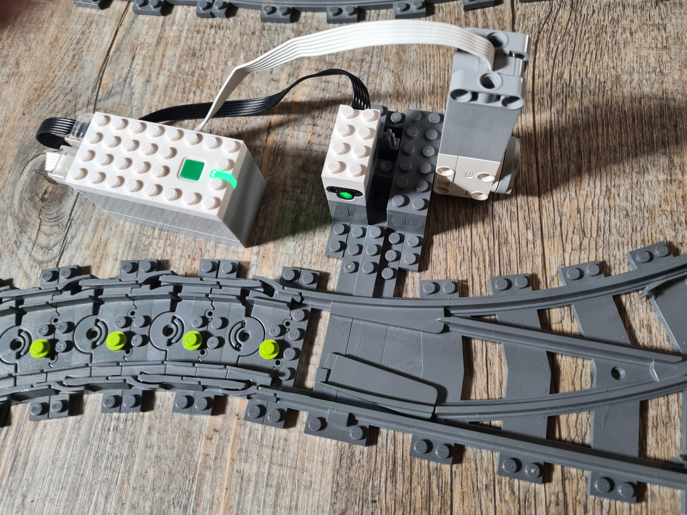

# Pybricks LEGO Train Switch Controller
Automate your LEGO train tracks by randomly change the direction of switches by detecting incoming trains. This [video](https://youtu.be/nyAEZ-QBgTA) shows how it can be used.

In principle, all the programs work in the same way: Trains are detected by an distance sensor which causes the switch to change direction (at least with some probability). Depending on the used hardware components (Powered Up Hubs and EV3 Mindstorms 31313) different programs are required as explained later in detail.

Most of the provided programs are running [PyBricks](https://pybricks.com/) code. However, for LEGO MINDSTORMs EV3 (31313) [EV3 MicroPython](https://pybricks.com/ev3-micropython/) is used. The LEGO MINDSTORMS Robot Inventor (51515) can be used either with PyBricks or with the official [LEGO MINDSTORMS Software with Python Programming](https://lego.github.io/MINDSTORMS-Robot-Inventor-hub-API/).

To get the motor rotation change the direction of the switch, a design of [SteinaufStein](https://www.youtube.com/channel/UCJ-c1vQHVZZ6S6xhjjNo7Gg) can be used ([video tutorial](https://youtu.be/Jwv6kI0IBoQ?t=63)). Note that for some powered up motors an additional gear ration is needed since the motors are too weak to move the switch position. Also note that this design only works for 6W (6 wide) trains (as all the LEGO City trains are), not for 8W or larger trains! You can use the design of [Bricks Works](https://www.youtube.com/@BricksWorks) for 8W trains ([english](https://youtu.be/kkVGYyH3zDw), [german](https://youtu.be/sTTl4Nep_6Q), [danish](https://youtu.be/293yJBwQ2W8)).


## Powered Up Hubs
All the programs for powered up hubs are running [PyBricks](https://pybricks.com/) code. The following description uses some PyBricks specific terms, so read their [documentation](https://docs.pybricks.com/en/stable/) to understand details. Also refer to [here](https://code.pybricks.com/) in order to actually run the provided python code on your powered up hubs.
> **_NOTE:_** Currently, the PyBricks Beta is needed for the latest features: [https://beta.pybricks.com/](https://beta.pybricks.com/)

For controlling the switches, you can use any type of motor with rotation sensor being compatible with the powered up system. The following picture from the (PyBricks Documentation](https://docs.pybricks.com/en/latest/pupdevices/index.html) shows the compatible motors.

These motors occur in motorized LEGO Technic Sets (like Liebherr R 9800 Excavator (42100), App-Controlled Cat® D11 Bulldozer (42131)) and in LEGO MINDSTORMS/ SPIKE sets (like Robot Inventor (51515), SPIKE Prime Set (45678)). 

As sensor any sensor which can determine a distance is possible. The pictures are again taken from the (PyBricks Documentation](https://docs.pybricks.com/en/latest/pupdevices/index.html).

| **Sensor** | **Color & Distance Sensor** | **Infrared/ Motion Sensor** | **Ultrasonic Sensor** | **Color Sensor** |
|-|-|-|-|-|
| **Python Class Name** | `SwitchDistanceSensor` | `SwitchIRSensor` | `SwitchUltrasonicSensor` | `SwitchColorSensor` | 
| **LEGO Item/ Part Number** | item 88007 | item 20844 | part 37316c01 | part 37308c01 |
| **LEGO Sets with this Sensor** | BOOST Creative Toolbox (17101), Droid Commander (75253), [sold as single item at LEGO store](https://www.lego.com/en-us/product/color-distance-sensor-88007) |  Grand Piano (21323), WeDo 2.0 Core Set (45300) | Robot Inventor (51515), SPIKE Prime Set (45678) | Robot Inventor (51515), SPIKE Essential Set (45345), SPIKE Prime Expansion Set (45681), SPIKE Prime Set (45678) |
| **Picture** |  |  |  |  |

Since all sensors except the Color & Distance Sensor are used only in MINDSTORMS/ SPIKE sets (which are EOL 2022), the Color & Distance Sensor seems to be the most suitable - also because it is sold individually by LEGO and is relatively cheap.

You can use the generic `SwitchSensor` method to create a sensor depending on what sensor is connected to the hub, e.g. `SwitchSensor(Port.A)` returns a `SwitchDistanceSensor` if a distance sensor is connected to `Port.A`, etc.

Once you have organized the hub, motor(s) and sensor(s), you are ready to run the program. Therefore you need to import the file [switch.py](switch.py) into PyBricks Code. Additionally you need to add your specific track configuration as described below with examples. This can be either done at the end of switch.py or in another file which imports switch.py, e.g.
```python
from switch import *
sensor = SwitchSensor(Port.A)
motor = SwitchMotor(Port.B)
controller = SwitchController()
controller.register_sensor(smart_sensor, motor)
controller.run()
```

### Powered Up Configuration Part
You can easily adjust the configuration depending on your actual switch layout and personal preferences. The following examples should cover the most important switch-sensor-motor-combinations. Note that depending on your specific train layout some parameters might need to be adjusted as explained in the [Special Features](#powered-up-special-features) section.

<table>
<tr>
  <td>Description </td> <td>Picture </td> <td>Code </td>
</tr>
<tr>
  <td>1 Sensor + 1 Switch </td> <td> </td>
<td>

```python
sensor = SwitchSensor(Port.A)
motor = SwitchMotor(Port.B)
controller.register_sensor(sensor, motor)
controller.run()
```

  </td>
</tr>
<tr>
<td> 1 Sensor + 2 Motors </td>
  <td></td>
<td>

```python
sensor = SwitchSensor(Port.A)
motor1 = SwitchMotor(Port.B)
motor2 = SwitchMotor(Port.C)
motor1.register_successor(motor2, SwitchPosition.CURVED)
controller.register_sensor(sensor, motor)
controller.run()
```

  </td>
</tr>
  <tr>
<td> 1 Sensor + 3 Motors </td>
  <td></td>
<td>

```python
sensor = SwitchSensor(Port.A)
motor1 = SwitchMotor(Port.B)
motor2 = SwitchMotor(Port.C)
motor3 = SwitchMotor(Port.D)
motor1.register_successor(motor2, SwitchPosition.CURVED)
motor1.register_successor(motor3, SwitchPosition.CURVED)
controller.register_sensor(sensor, motor)
controller.run()
```

  </td>
</tr>
    <tr>
<td> 2 Sensors + 2 Motors </td>
  <td></td>
<td>

```python
sensor1 = SwitchSensor(Port.A)
sensor2 = SwitchSensor(Port.C)
motor1 = SwitchMotor(Port.B)
motor2 = SwitchMotor(Port.D)
controller.register_sensor(sensor1, motor1)
controller.register_sensor(sensor2, motor2)
controller.run()
```

  </td>
</tr>
</table>

Note that for the [City Hub](https://www.lego.com/en-us/product/hub-88009) (the hub used for the City trains), only the first example can be used since only two ports are available (see [here](examples/1sensor_1motor.py)). In particular, another special program is available for this case which is easier to understand (especially if you are not familiar with object oriented programming): [CityHub_easy.py](CityHub_easy.py).

Personally, I recommend to first running the program without including the current program to the hub's firmware. So you can easily experiment different settings and see what fits your purposes best (errors can be seen in the terminal). Once the program is ready, flash the hub and include the current program to the firmware (Currently this option is available under "Settings" -> "Firmware" -> "Include current program"). This causes that the flashed program is executed whenever the hub is started in the future - unless you reflash it again. You can easily reflash the original LEGO firmware by connecting the hub to the powered up app. The disadvantage of flashing the program to the firmware is that you can no longer see the terminal output, so make sure that the program runs without errors before doing this.

### Powered Up Special Features
- **Colors**:
  - `RED`: Switch is currently moving the direction. No train should now be passing the switch! Otherwise derailments could occur!
  - `ORANGE`: Currently a switch is detected in front of the sensor
  - `YELLOW`: Currently no train is in front of the sensor, but a train was detected a short time ago (so either the transition of two wagons is in front of the sensor or the train passed completely the sensor a short time ago)
  - `GREEN`: otherwise (sensor is waiting for an incoming train)
  - In case of a program with multiple sensors, the first color in the list is shown whose condition is true for at least one sensor
- **Power Off**: Use the green button of the hub to power the controller off. This might cause resetting the switches to the initial state.
- **Probabilities**: The constructor `SwitchMotor` has the optional parameters `probability_straigth_to_curved` and `probability_curved_to_straigth` (default value `0.5` each). The default configuration means, that the motor moves on average after every second train. Setting both parameter to `1.0` means that the motor moves at every train. Setting `probability_straigth_to_curved < probability_curved_to_straigth` means that the motor is more often in the *straight* position.
```python
  motor = SwitchMotor(Port.B, probability_straigth_to_curved=0.5, probability_curved_to_straigth=0.8)
```
- **Motor Auto Calibration**: Of course the `SwitchMotor` needs to know what motor positions correspond to which `SwitchPosition` (either `STRAIGHT` or `CURVED`). This is achieved by 
  - the parameter `switchPosition` in it's constructor which states the initial `SwitchPosition` (default is `STRAIGHT`)
  ```python
    motor = SwitchMotor(Port.B, switch_position=SwitchPosition.CURVED)
  ```
  - an information how much the motor needs to move to get to the other position. This can be achieved by the parameter `turn_degrees` which is equal to the degrees from the initial position to the other. However it is really complicated to figure out the right number (depends obviously on the gear ratio, ...). If `turn_degrees` is None (as it is by default), an auto calibration is done i.e. the motor moves left and right until the motor stalls. Make sure that the motor is connected to the switch otherwise it would move forever!
  ```python
    motor1 = SwitchMotor(Port.B, turn_degrees=100) # fixed degrees
    motor2 = SwitchMotor(Port.C, turn_degrees=None) # auto calibration
  ```
- **Distance Sensors**: As described above multiple distance sensors are supported: `SwitchDistanceSensor`, `SwitchIRSensor`, `SwitchUltrasonicSensor`, `SwitchColorSensor`. All sensors have a parameter `criticalDistance` which refers to the distance from which the sensor should be triggered (detect a train). A larger `criticalDistance` means that also objects further away are recognized. Default values are given for each sensor type, but the perfect value for you might depend on the sensors's positioning and the lightning conditions. For me, the `SwitchDistanceSensor` works the most reliable. You can also use the generic `SwitchSensor` to dynamically create the sensor with the connected type.
 ```python
  sensor = SwitchDistanceSensor(Port.A, critical_distance=50) # critical distance in %
  sensor = SwitchIRSensor(Port.B, critical_distance=80) # critical distance in %
  sensor = SwitchUltrasonicSensor(Port.C, critical_distance=400) # critica distance in mm
  sensor = SwitchColorSensor(Port.D, critical_distance=70) # critical distance in %
  sensor = SwitchSensor(Port.E) # generic sensor -> detects automatically the sensor type and uses default critical_distance values
 ```
- **Smart Sensors**: It is even possible to wrap multiple sensors together in a `SmartSensor`. As indicated by the name, this sensor can make *smarter* decision which might lead to less train crashes. The `SmartSensor` distinguishes in *pre-sensors* and *post-sensors*.
  - A *pre-sensor* is basically a normal Distance Sensor as described above, i.e. an instance of `SwitchSensor`. Those sensors are intended to be placed in front of the switch in order to detect incoming trains of the observed switch. Note that you can also use multiple sensors to detect an incoming train. This might lead to a more reliable train detection. Additionally, this can prevent that the switch moves just before a train drives in front of the sensor. Since the moving takes a little bit, this can derail the train (if the train is too fast and the sensor is too close to the switch). By using an additional sensor more away from the switch, this can be prevented.
  - A *post-sensor* is a sensor which knows if an output of this switch layout is currently blocked. The smart decision will prevent that trains are directed to a blocked track. After the blocked track becomes free again, the switch will automatically move back to this track. Since a post-sensor is also an instance of `SwitchSensor`, it can also be used additionally as normal sensor in another switch setup. In the future, it will be even possible to capture sensors of other hubs via Bluetooth (Not implemented yet).

> **Note**
> The `SmartSensor` is a new feature and not well tested yet. If you recognize any unexpected behavior, please create an issue with a detailed description of the problem.

The examples below show the usage. The post-sensors are configured using a path of `SwitchDirection`s, i.e. `(SwitchDirection.STRAIGHT, SwitchDirection.CURVED)` means that the post-sensor captures the corresponding output of the switch layout. Note that you need to write an additional comma if you want to create a `tuple` of size 1 e.g. `(SwitchDirection.STRAIGHT,)`. 
```python
  # example with two pre sensors
  pre_sensor1 = SwitchSensor(Port.A)
  pre_sensor2 = SwitchSensor(Port.B)
  post_sensor = SwitchSensor(Port.C)
  # the post sensor is placed after the track beyond the STRAIGHT output of the switch
  post_sensors = {(SwitchDirection.STRAIGHT,): post_sensor}
  smart_sensor = SmartSensor(pre_sensor1, pre_sensor2, post_sensors=post_sensors)
  motor = SwitchMotor(Port.D)
  controller = SwitchController()
  controller.register_sensor(smart_sensor, motor)
  controller.run()
```
This example illustrates like this: 

```python
  pre_sensor1 = SwitchSensor(Port.A)
  # the first post sensor delays the blocking signal by 100*dt=100*50ms=5s
  # i.e. after a train blocks this sensor, the track of the switch will be first seen as blocked after 5s in the controller
  post_sensor1 = SwitchSensor(Port.B, post_sensor_delay=100)
  # post sensor 2 should block the track for additional 40*dt=40*50ms=2s after the train passed
  post_sensor2 = SwitchSensor(Port.C, post_sensor_init_timeout=50)
  # post_sensor1 captures the track behind the output STRAIGHT -> CURVED (i.e. go the first switch STRAIGHT, the 2nd one curved)
  post_sensors = {(SwitchDirection.STRAIGHT, SwitchDirection.CURVED): post_sensor1, (SwitchDirection.CURVED,): post_sensor2}
  smart_sensor = SmartSensor(pre_sensor, post_sensors=post_sensors)
  motor1 = SwitchMotor(Port.D)
  motor2 = SwitchMotor(Port.E)
  motor1.register_successor(motor2, SwitchDirection.STRAIGHT)
  controller = SwitchController()
  controller.register_sensor(smart_sensor, motor)
  controller.run()
```


- **Timeout**: Since the sensor usually does not trigger for the whole time a train is passing by (e.g. between two train trailers), a timeout is used to skip those gaps. Additionally, the timeout is needed if the motor moves *after* a train has passed. In that case the train still needs some time to pass the (last) switch (distance from sensor to the last switch). The length of the `timeout` can be set by using `sensor.set_init_timeout(40)` or `SwitchSensor(Port.A, init_timeout=40)` where 40 is the timeout value. Note that the meaning of the timeout value depends on the `dt`-value (time in ms between two ticks) of the SwitchController. The default `dt`-value of 50ms combined with an timeout of 40 means that after 40 * 50ms = 2s without sensor triggering a train is considered to be passed completely. The default is `init_timeout=20`.
- **Rising/ Falling Edge** Two options when the switch moves are provided: The motor moves right when an incoming train is detected (`SwitchMode.RISING_EDGE`) or after a train has passed the sensor (and switch) completely (`SwitchMode.FALLING_EDGE`). The option can be set by using `sensor.set_switch_mode(SwitchMode.RISING_EDGE)`. However, I can only recommend using `SwitchMode.FALLING_EDGE` (default value) since the powered up motors seem to be too weak/ slow (the moving of the motor takes too long). Unless the distance between the sensor and the switch isn't far and/ or the trains are driving slow, the rising edge mode didn't work for me reliable with powered up motors. By the way the MINDSTORMS EV3 motors are using the rising edge mode.
```
  sensor = SwitchSensor(Port.A, switch_mode=SwitchMode.RISING_EDGE)

  # or alternatively
  sensor = SwitchSensor(Port.A)
  sensor.set_switch_mode(SwitchMode.RISING_EDGE)
```

## MINDSTORMS (Robot Inventor 51515, SPIKE Prime 45678)
The [PyBricks](https://pybricks.com/) code for these hubs works similar to the ones using the Powered Up Hubs. Just use [switch.py](switch.py) and your own configuration.

Of course all [Powered Up Configuration Examples](#powered-up-configuration-part) can also be used for the MINDSTORMS Hubs. But because of the additional available ports, even more (complex) configurations become possible. Again you need to add either the few lines at the end of the program or inside another file and import switch.py by `from switch import *`.

<table>
<tr>
  <td>Description </td> <td>Picture </td> <td>Code </td>
</tr>
<tr>
  <td>2 Sensors + 3 Switchs </td> <td></td>
<td>

```python
sensor1 = SwitchSensor(Port.A)
sensor2 = SwitchSensor(Port.B)
motor1 = SwitchMotor(Port.C)
motor2 = SwitchMotor(Port.D)
motor3 = SwitchMotor(Port.E)
motor1.register_successor(motor2)  
controller.register_sensor(sensor1, motor1)
controller.register_sensor(sensor2, motor3)
controller.run()
```

  </td>
</tr>
  <tr>
  <td>2 Sensors + 4 Switchs (2 times (1 Sensor + 2 Switch) </td> <td></td>
<td>

```python
sensor1 = SwitchSensor(Port.A)
sensor2 = SwitchSensor(Port.B)
motor1 = SwitchMotor(Port.C)
motor2 = SwitchMotor(Port.D)
motor3 = SwitchMotor(Port.E)
motor4 = SwitchMotor(Port.F)
motor1.register_successor(motor2, switch_position=SwitchPosition.CURVED)  
motor2.register_successor(motor4, switch_position=SwitchPosition.CURVED)
controller.register_sensor(sensor1, motor1)
controller.register_sensor(sensor2, motor3)
controller.run()
```

  </td>
</tr>
    <tr>
  <td>2 Sensors + 4 Switchs (1 Sensor + 1 Switch and 1 Sensor + (1+2)  Switches) </td> <td></td>
<td>

```python
sensor1 = SwitchSensor(Port.A)
sensor2 = SwitchSensor(Port.B)
motor1 = SwitchMotor(Port.C)
motor2 = SwitchMotor(Port.D)
motor3 = SwitchMotor(Port.E)
motor4 = SwitchMotor(Port.F)
motor2.registerSuccessor(motor3, switch_position=SwitchPosition.STRAIGHT)  
motor2.registerSuccessor(motor4, switch_position=SwitchPosition.CURVED)
controller.register_sensor(sensor1, motor1)
controller.register_sensor(sensor2, motor2)
controller.run()
```

  </td>
</tr>
<tr>
  <td>2 Sensors + 4 Switchs (1 Sensor + 1 Switch and 1 Sensor + (1+1+1)  Switches) </td> <td></td>
<td>

```python
sensor1 = SwitchSensor(Port.A)
sensor2 = SwitchSensor(Port.B)
motor1 = SwitchMotor(Port.C)
motor2 = SwitchMotor(Port.D)
motor3 = SwitchMotor(Port.E)
motor4 = SwitchMotor(Port.F)
motor2.register_successor(motor3, switch_position=SwitchPosition.CURVED)  
motor3.register_successor(motor4, switch_position=SwitchPosition.CURVED)
controller.register_sensor(sensor1, motor1)
controller.register_sensor(sensor2, motor2)
controller.run()
```

  </td>
</tr>
      <tr>
  <td>3 Sensors + 3 Switchs</td> <td></td>
<td>

```python
sensor1 = SwitchUltrasonicSensor(Port.A)
sensor2 = SwitchColorSensor(Port.B)
sensor3 = SwitchDistanceSensor(Port.C)
motor1 = SwitchMotor(Port.D)
motor2 = SwitchMotor(Port.E)
motor3 = SwitchMotor(Port.F)
controller.register_sensor(sensor1, motor1)
controller.register_sensor(sensor2, motor2)
controller.register_sensor(sensor3, motor3)
controller.run()
```

  </td>
</tr>
</table>


In case you don't want to flash your MINDSTORMS with PyBricks firmware, you can still use a version for the official LEGO Mindstorms Software with Python Programming: [MINDSTORMS_51515.lms](MINDSTORMS_51515.lms)/ [MINDSTORMS_51515_LEGO_python.py](MINDSTORMS_51515_LEGO_python.py). However, because of the very limited functionality of the programming language, only a 1 Switch + 1 Motor layout is provided (with less modification possibilities compared to the PyBricks version). 

### Special Features
Additionally to the [Powered Up Hub Speical Features](#powered_up_special_features) the light matrix is used to indicate the progress of the sensor timeout. Depending on the number of sensors the color matrix shows progress bar(s) indicating the timeout progress. If a motor is currently moving, the color matrix shows a cross ('x') additionally to the red light.

<table><tr><td>
  </td>
  <td></td>
<td></td>
</tr>
</table>

## MINDSTORMS EV3 (31313)
To run python programs on an EV3, you first need to follow these [instructions](https://pybricks.com/install/mindstorms-ev3/installation/). After that you can use the following programs:

|Description | Image | Program |
|-|-|-|
|2 Sensors + 2 XL Motors | | [program](ev3_switch_1_1_XL_XL.py)|
|1 Sensor + 2 XL Motors | | [program](ev3_switch_2_XL_XL.py)|
|2 Sensors + 2 XL Motors + 1 M Motor |  | [program](ev3_switch_2_1_XL_M_XL.py)|

Of course not all possible combinations of sensors and motors are provided. In addition the programs aren't that flexible as the PyBricks ones. However the basic idea how to adjust the code for a certain sensor-motor-layout should be obvious.

## Known Issues
- Some pictures of configurations are missing
- As soon as communication between hubs is possible, this makes a lot of new features possible (large chained layouts are possible -> no limitation due to limited available ports). Furthermore, it would be awesome if PyBricks Hubs could connect to an app which supervises *all* hubs.
- The `SmartSensor` is a new feature and not well tested yet

If you find any unexpected behavior or have a feature request, please create an issue or a pull request.
